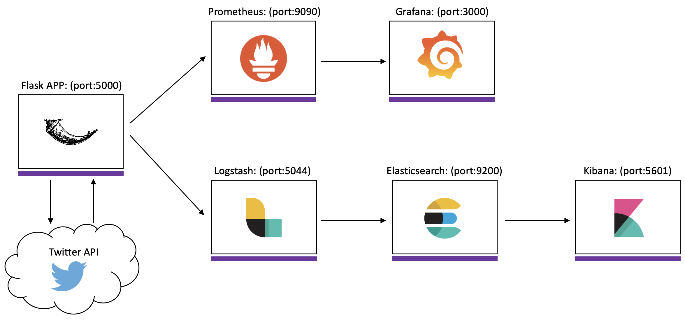
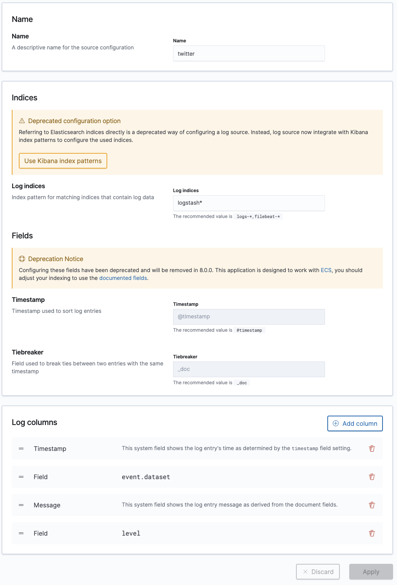
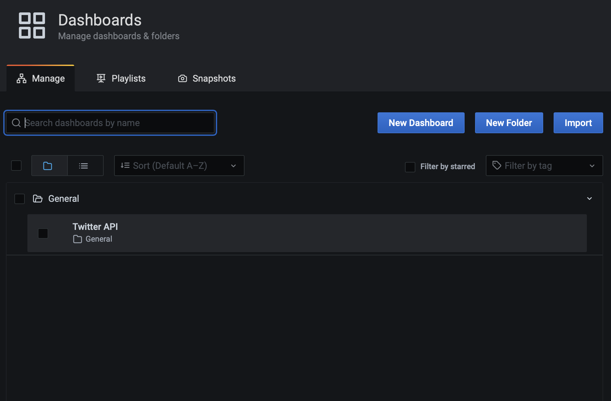
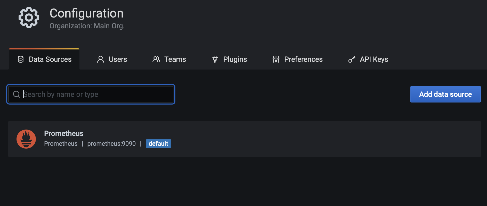
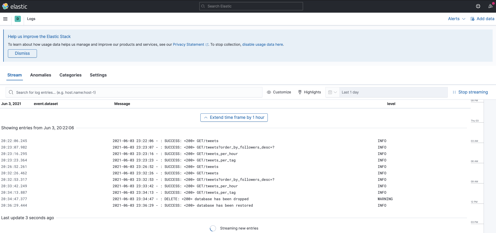
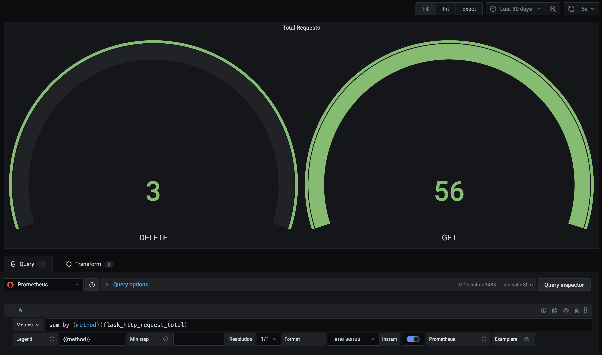
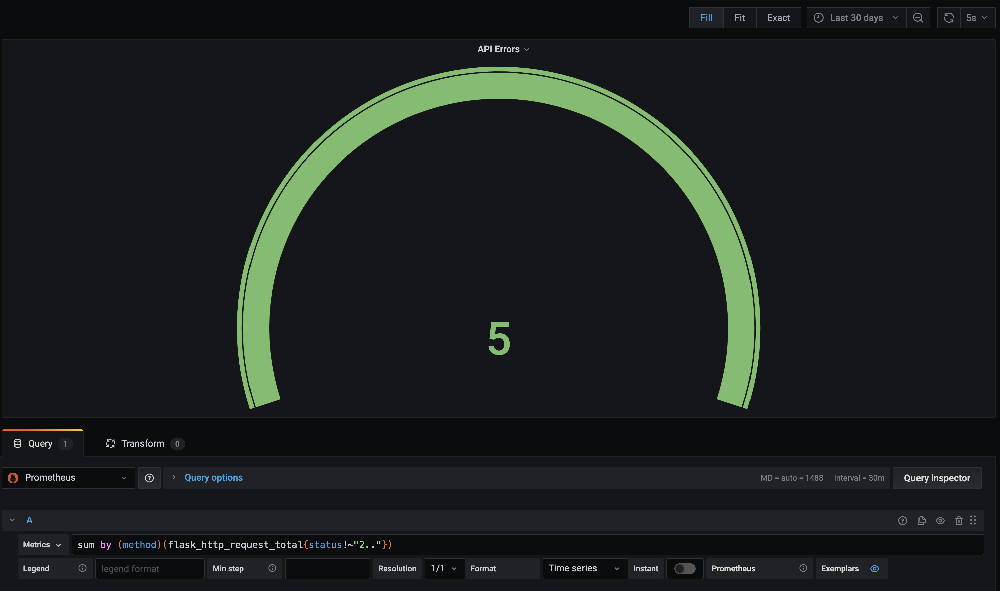
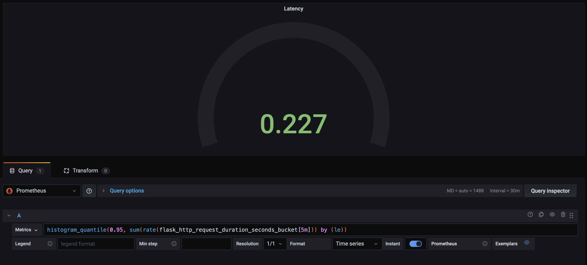
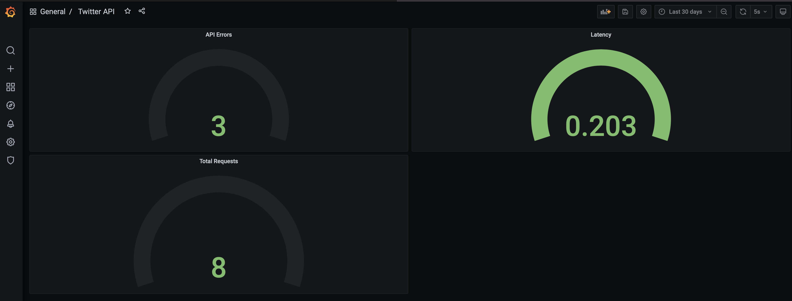

# **Twitter Rest API**

## **Documentation quick links**:
- [Project](#project)
- [API](#api)
- [Archtecture](#Architecture)
- [Reproducing](#reproducing)
- [Logs](#logs)
- [Metrics](#metrics)

<br />

## **Project**

### The purpose of this Flask API is handle some data comming from twitter. As mentioned before this is a Python Flask Application and, in order make the developement and all proccess more easy, some libs was used such as:

<br />

### **Flask**:
Which allow us to perform http requests.

### **Tweepy**:
`Tweepy` provides access to the well documented Twitter API and allow us to get an object from the API, besides being easy to manipulate it.

### **SQLite3**:
Using a file format, `sqlite3` gives a better performance reading and writing. And the most important, is really simple to use.

### **SQLAlchemy**:
`SQLAlchemy` works really well with `sqlite3`, it allow us to map a model class and perform pre-seted functions. In our case we're using SQLAlchemy to map tweet model class and build all the database and table structure without write a single line of SQL.

### **Logstash**:
Allow us to set some configuration (handler/formatter) and connection with the `logstash` service.

### **PrometheusMetrics**
Once declared and referenced to the Flask App, it will automatically expose and publish metrics on `<flask_app_url>/metrics`.

### **Project tree**:

```
├── grafana
│   └── provisioning
│       ├── dashboards
│       │   ├── dashboard.json
│       │   └── dashboard.yml
│       └── datasources
│           └── datasource.yml
├── kibana
│   └── config
│       └── kibana.yml
├── logstash
│   ├── config
│   │   └── logstash.yml
│   └── pipeline
│       └── logstash.conf
├── models
│   ├── __init__.py
│   └── tweet.py
├── prometheus
│   └── prometheus.yml
├── resources
│   ├── __init__.py
│   ├── drop.py
│   ├── hourly.py
│   ├── tags.py
│   └── tweet.py
├── Dockerfile
├── READEME.md
├── alchemy.py
├── api.py
├── app.py
├── docker-compose.yml
├── logstash.py
└── requirements.txt
```
<br />

## **API**
For the data collection the project uses a #tag filter. These #tags are hardcoded in `api.py file`. If you are running the docker compose that I provided, It's going to use the dockerhub image I already upload with all the #tags, if you choose to build your own image you can change the #tags to make more sense for your porpouse.

##### These values can easily be passed through a configuration file, but I judged it unnecessary given the challenge presented.

```python
tags = {"#openbanking", "#remediation", "#devops", "#sre", "#microservices", "#observability", "#oauth", "#metrics", "#logmonitoring", "#opentracing"}
```
You can configure the total of tweets collected per #tag as well, just adjusting this variable in the same file:

```python
tw_number = 100
```

In the root path you'll find `postman-twitter-api.json`, that's a colletion for postman. Import this file into your postman and it will give you all the endpoints created:

I'm considering that you're running it on localhost, so your base URL should be some like this `http://localhost:5000`. Now, the endpoints:

#### **NOTE**: At the very first running, the API will perform the data colletion from Twitter, since this API is configured to get 100 tweets per #tags it can take some time to finish, something arounf 30/40 secs. It'll be almost 1000 line of record.

<br />

### **EndPoints:**

<br />

```
GET /tweets
```
It will return a json format with all tweets collected containing some fields: `tweet`, `author`, `followers`, `created`, `lang`, `country` and `rash`.

<br />

```
GET /tweets?order_by_followers_desc=?
```
Will return an desc list containing all authors listed by what has the most followers to what has the least. To define how many will be the top ones, change `order_by_followers_desc` to the desired number. E.g.: `order_by_followers_desc=5`, this will bring to us the top 5 authors with most followers from the collected sample.

<br />

```
GET /tweets_per_hour
```
This will bring to us the total of tweets grouped per hour of the day.

<br />

```
GET /tweets_per_tag
```
Will return the total of tweets grouped by language and #tags.

<br />

```
DELETE /database
```
This endpoint will drop the database.

<br />

```
GET /database
```
This endpoint will collect new data from Twitter API.
#### **NOTE**: If you already have the database and run this again, probably you may have some duplicate info. I recommend drop the base before to get new one.

<br />

## **Architecture**
This project runs into docker containers separating all services to have low coupling. It will create a docker container for each service:

This project has a simple flow. The application send a request to `Twitter API` and API returns with the data if succeds. Application has a connection with `logstash` service that process all logs generated py app and send it to `elasticsearch`. Once it's stored in `elasticsearch`, `kibana` also has a connection with `elasticsearch`, get the indexed logs and work on a better logs render. We can simple stream logs from `kibana`, write queries and so on.

At the same time, Flask App has also a connection with prometheus and stream all the metrics from our app. Prometheus is responsible to scrap the metrics from the `/metrics`. In this case I'm using grafana to connect into prometheus and render the metrics.


**Architectural Diagram**:



<br />

## **Reproducing**
To reproduce this stack on your local you'll only need a couple of tools: [Docker](https://docs.docker.com/get-docker/), [Docker Compose](https://docs.docker.com/compose/install/) and [Git](https://git-scm.com/) installed.

1. Once all tolls is installed it's time to download the project. This is a publich repo so you can easily perform a `git clone` for this one at the desired path on your local.

2. Now that you have the project on your local you'll need to do some configuration inside some files.
    1. At root path you'll find a file called `.env`, that's placed all the credentials for Twitter Api. If you are not familiar with Twitter developer portal, you can find all the instructions [here](https://developer.twitter.com/en/docs/twitter-api/getting-started/getting-access-to-the-twitter-api), how to create an account and how to get these mentioned credentials.

        ```shell
        TWITTER_CONSUMER_KEY=<consumer-key>
        TWITTER_CONSUMER_SECRET=<consumer-secret>
        TWITTER_ACCESS_TOKEN=<access-token>
        TWITTER_ACCESS_TOKEN_SECRET=<access-secret>
        ```
        Change the placeholder values to your actual creds.
    
    2. You'll find another conf file at `grafana/.env`. Change the placeholder to the user and password that you desire to use.

        ```shell
        GF_SECURITY_ADMIN_USER=<username>
        GF_SECURITY_ADMIN_PASSWORD=<password>
        ```
        Now you're ready to go!

3. At the root path, run the following command:

    ```shell
    docker-compose up -d
    ```
    It will run all containers needed to the stack in background given by the tag `-d`.
    At the end of the run, you probably will see some output like this:

    ```shell
    Creating prometheus    ... done
    Creating elasticsearch ... done
    Creating grafana       ... done
    Creating kibana        ... done
    Creating logstash      ... done
    Creating twitterapi    ... done
    ```

4. Now you have all containers up and running. This is the Url you must reach to access the services:
    * [TwitterApi](http://localhost:5000) => http://localhost:5000
    * [Logstash](http://localhost:5044) => http://localhost:5044
    * [Elasticsearch](http://localhost:9200) => http://localhost:9200
    * [Kibana](http://localhost:5601) => http://localhost:5601
    * [Prometheus](http://localhost:9090) => http://localhost:9090
    * [Grafana](http://localhost:3000) => http://localhost:3000

    To turn all services off you simply have to run this command:
    ```shell
    docker-compose down
    ```

## **Post provisioning configuration**
After have all services running to access `Kibana` and `Grafana` services a little conf is needed.

**Kibana**:
1. Open Kibana url. In the sidebar click in `Logs` at the `Observability` section. Add a new index and configure it on settings as figure bellow:


    

**Grafana**:
1. Log into Grafana, in sidebar go to `dashboard` -> `manage`. You'll have some like:

    

    You can also check the datasource created on `configuration` -> `datasource`.

    

<br />

## **Logs**:
As mentioned before all logs are stored in `elasticsearch` and being displayed via Kibana.



In the message body the application is sendding ans status to the request, the status code and the explicit message.

<br />

## **Metrics**:
After login in `grafana` with the credentials you've created before, you'll able to see three painels in the `twitter-api` dashboard.

Total of requests:


Total requests dashboard is separeted by method.

<br />

API Errors:


All requests that returns diferent than 2XX will consider as an error. E.g. `400`, `404`, `500`, `429`.

<br />

API Latency:


This dashboard will display the API latency rate for the passed 5 minutes.
#### **NOTE**: When you run database deletion or creation the latency rate may seems a little hight due these two requests usually take a little longer than others.

### **Dashboard overview**:

